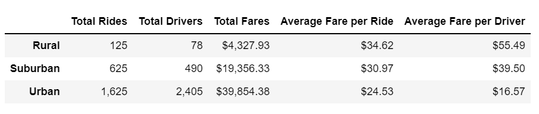
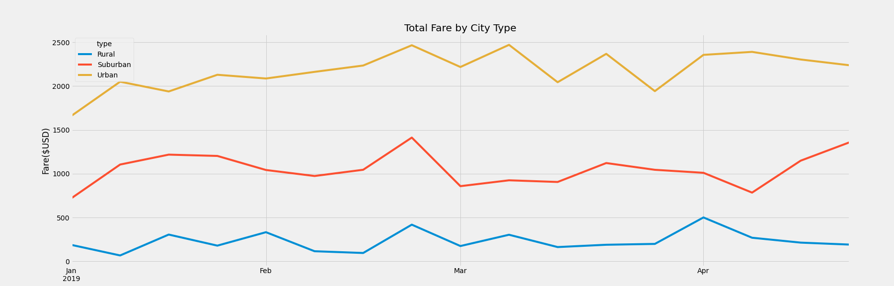

# Pyber_Analysis_Challenge
## Overview
Assignment is to deliver a summary dataframe and and multiple line plot that displays totals and averages across city classes.  

## Election Audit Results
 
 
 
 
 
 

## Election Audit Summary
The script here can be re-purposed and used across the state in other elections or based on changes to the data tracked in the elections report.
1. Statistics can be tabulated for other geographical areas (i.e. precincts, census blocks) if that data is ever appended to the source dataset schema.
2. Determinations as to winning candidate, winning percentage could be modifed in cases where the winning threshold changes or is more dyanmic for elections that use a ranked choice method to determine the victor.
